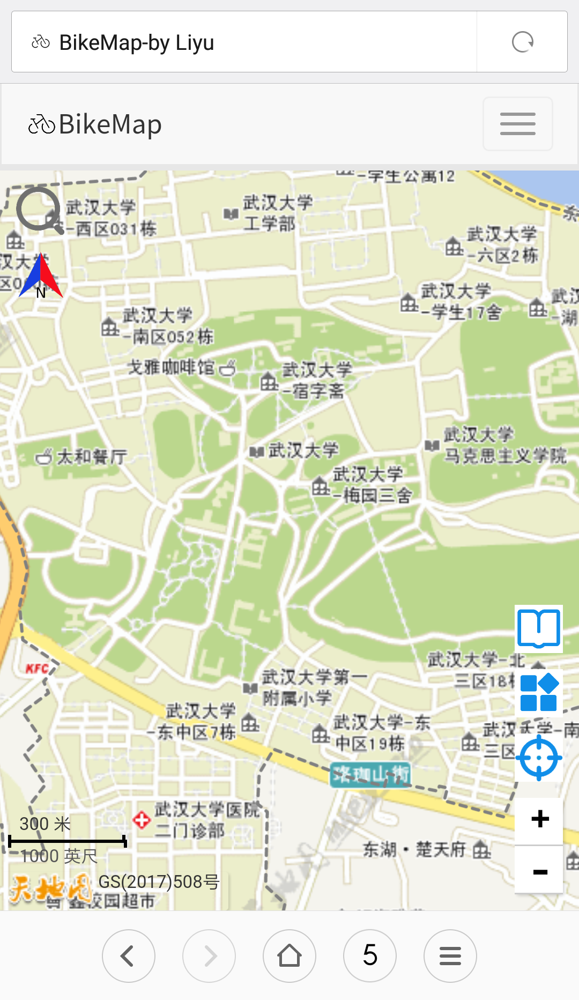

# BikeMap 

2017年暑假写的一个武汉大学自行车规划网站[https://railwayhs.cn/BikeMap](https://railwayhs.cn/BikeMap)，现在开源出来。

#### 技术栈
HTML+CSS(Bootstrap)+JS(Jquery)

#### 功能

1. 武大校内骑行路线规划
2. 规划采用四种影响因子：距离、坡度、绿茵、减速带，因子权重可自定义
3. 规划算法有两种：Dijkstra算法（默认）和Floyd算法
4. 可以展示所有道路采样点、边和高程热力图
5. 可以展示卫星图以及武大校内POI点
6. 线路以外的点会规划到最近的边上
7. 可以记录查询的历史轨迹
8. 每条规划路径对路线上的影响因子做可视化表达、导航提示
9. 展示规划路径的三维效果图
10. 可搜索武大校内的POI点并定位
11. PC和移动端均可适配
12. 底图基于天地图，规划算法均手写

#### 页面链接

[主页](https://railwayhs.cn/BikeMap/index.html)  
[地图](https://railwayhs.cn/BikeMap/map.html)  
[日志](https://railwayhs.cn/BikeMap/about.html)  
[关于](https://railwayhs.cn/BikeMap/contact.html)  

[为何建站Why](https://railwayhs.cn/BikeMap/introduction_1.html)  
[网站特色What](https://railwayhs.cn/BikeMap/introduction_2.html)  
[如何建站How](https://railwayhs.cn/BikeMap/introduction_3.html)  

#### 效果图

#### 个人相关项目

近一年参与的三个小程序项目，有兴趣可以看一下，以后可能会开源。

	

		
		
约球online

	

	

		
		
Boat(wx)

	

	

		
		
Boat(qq)

	

	

		
		
当下日程(wx)

	

	

		
		
当下日程(qq)

	

